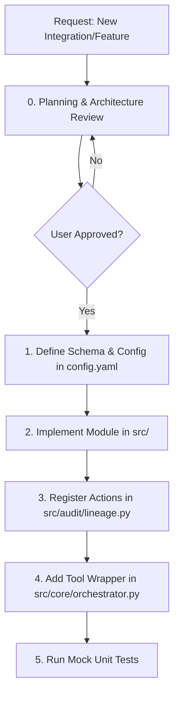

# Agent Harness Builder Skill

This skill provides the core workflows, guidelines, and patterns for developing, extending, and maintaining the **Agent-X1** autonomous agentic harness. Use these instructions when adding tools, updating orchestrator states, debugging connection issues, or refining lineage logging.

---

## 1. Extension Workflows

When implementing new features or resolving issues in the harness, follow these systematic steps:



### 1.0 Step 0: Planning, Architecture Review, & Design Finalization (MANDATORY)
Before writing any code or modifying configurations, you **MUST** first finalize the design details and implementation steps with the user:
1. Research the codebase context and gather OS-specific implications.
2. Outline the exact components and files to modify or add.
3. Formulate the requirements clarification questionnaire (using Section 4).
4. Create/update the `implementation_plan.md` artifact and present it to the user.
5. **STOP and wait for the user's explicit review and approval.** Do not start the build phase (Step 1-5) until sign-off is given.

### 1.1 Step 1: Configuration Spec
Before coding, specify the necessary YAML keys in `config.yaml`.
* Decouple credentials (tokens/keys) from code using environment variable templates (e.g., `api_key: ${ENV_VAR}`).

### 1.2 Step 2: Implement the Core Module
* Create isolated modules under `src/<module_name>/`.
* Write OS-agnostic code using Python's `pathlib`.
* Ensure that all internal methods handle errors gracefully and raise structured exception classes (e.g., `InferenceError`, `IntegrationError`).

### 1.3 Step 3: Integrate with Lineage Logging
Every file-writing action, database transaction, or external API mutation must log audit trail events.
* Invoke `LineageLogger.log_action()` containing:
  - `correlation_id` (passed through context).
  - `action` (e.g., `file_write`, `api_post`).
  - File hashes (`pre_hash` and `post_hash`) for mutations.
  - LLM justification text.

### 1.4 Step 4: Expose to the Orchestrator
* Register the new functionality as a tool within the `ToolRunner` class.
* Define precise parameter JSON schemas for the LLM to inspect.

---

## 2. Design Patterns & Best Practices

### 2.1 OS-Agnostic Command Execution
Always route shell execution using system checks:
```python
import sys
import subprocess

def run_command(command: str):
    if sys.platform.startswith("win"):
        # Wrap command in powershell execution bypass
        shell_cmd = ["powershell.exe", "-NoProfile", "-ExecutionPolicy", "Bypass", "-Command", command]
    else:
        # Linux/macOS standard bash command
        shell_cmd = ["/bin/bash", "-c", command]
        
    return subprocess.run(shell_cmd, capture_output=True, text=True)
```

### 2.2 Token-Swapper Safeguards
When calling the Copilot internal endpoints:
1. **Never hardcode paths**: Use `os.path.expandvars` and `pathlib.Path.home()` to locate `hosts.json`.
2. **Token TTL Caching**: Store the swapped JWT along with its expiration timestamp. Check `time.time() < token_expiry - 300` before every call. If expired, perform the handshake.
3. **User-Agent Integrity**: Always use a standard IDE client user agent (e.g., `GithubCopilot/1.250.0`) to avoid token rejection.

### 2.3 Memory & Local Database Management

When implementing or updating the memory manager (`src/memory/memory.py`):
1. **SQLite Episodic Memory**:
   - Always use connection context managers: `with sqlite3.connect(db_path) as conn:`.
   - Set `timeout=30.0` to prevent database locks from concurrent API server and background job daemon operations.
   - Enforce database schemas at boot time (e.g. run `CREATE TABLE IF NOT EXISTS` commands on initialization).
   - **Enforce Partitioning**: Every schema relating to actions, errors, or learnings must contain an `agent_owner` field (values: `orchestrator`, `codeworker`, `testworker`, `devopsworker`).
   - Create compound indexes on lookup fields: `(agent_owner, correlation_id)` in action tables and `(agent_owner, task_id)` in feedback tables.
2. **Semantic Memory (Vector DB)**:
   - For a lightweight Windows/Linux environment, use a NumPy-based cosine similarity matrix or `LanceDB` (which runs in-process). Avoid heavy JVM-based or local service databases (like Qdrant or Milvus) to ease installation.
   - Decouple the embedding generator: wrap the embedding model in a provider interface so we can swap between a local CPU-based sentence-transformer model and external embedding endpoints.
   - **Tag Vectors**: Store `agent_owner` in vector metadata for lookup queries.
   - Return scores alongside vectors; discard hits below a configurable similarity threshold (e.g., `similarity < 0.75`).
3. **Cross-Referencing Interface**:
   - Program the `query_memory` method to accept `target_owners: List[str] = None`. By default, restrict searches to the executing agent's own owner value, but allow explicit list overrides to search other agents' histories.
   - Limit database write operations strictly to the executing agent's own `agent_owner` string to prevent partition pollution.
4. **RAG Prompt Injection & Formatting**:
   - Program the context compiler to serialize retrieved memory matches into an easily parsable markdown block (`=== RELEVANT CONTEXT FROM LOCAL PERSISTED MEMORY === ... ===`).
   - Append details of the source agent, issue description, resolution action, and file diffs/command lines.
   - Inject this context block directly into the system message context of the prompt pipeline right before execution.

### 2.4 Structured LLM Planning & Dynamic Re-planning

When writing orchestrator planning routines:
1. **JSON Schema Outputs**: Enforce structured outputs (e.g. JSON matching a Pydantic schema) for the task decomposition step. The LLM must return a clean list of tasks with dependencies, worker assignments, arguments, and verification metrics.
2. **Re-planning Trigger**: If a worker exhausts its retries, pack the execution logs, error output, and workspace state, then call the LLM to dynamically modify the DAG (add new recovery nodes or skip/adjust failing steps).
3. **Escalation Rules**: If the LLM indicates a re-planning loop has hit a logical deadlock, immediately set the state to `blocked` and trigger the human gate (CLI prompt or Teams card).
4. **Adaptive Re-planning Gating**:
   - Program the orchestrator to classify plan shifts into Minor or Major categories.
   - Enforce hard-coded Major triggers: dependency installs, core config edits, database migrations, file deletions.
   - Enforce semantic soft triggers: search local `feedback` logs for similarity with past user-approved/rejected plan changes.
   - Log the user's gating responses (approved vs. rejected) to iteratively mature the classification threshold.

### 2.5 Mandatory Goal-Planning Gate
1. **Plan Generation**: Write a structured `tasks_plan.md` file to the workspace before execution containing the goals, Correlation-ID, decomposed tasks, worker assignments, and dependencies.
2. **Approval Check**: If `auto_approve_planning` is disabled, block execution until the user sets the `- [x] I approve this plan` checkbox (case-insensitive check) in `tasks_plan.md` or calls `POST /v1/tasks/{id}/approve`.
3. **Plan State Updates**: Update the status line in `tasks_plan.md` dynamically (e.g. Completed, Failed, Aborted, Deadlocked, Approved) depending on run outcomes.

### 2.6 Task-Level Gating & Blocked Execution (Major Changes)
1. **Classification of Major Changes**: Major changes include dependency installations, force git pushes, file deletions, and database migrations.
2. **Execution Blocking**: If a Major change task is hit and `auto_approve_tasks` is disabled, transition the session status to `"paused_for_task_approval"`, clear the sync event, and block using thread synchronization.
3. **Resumption**: Resume execution only when the approve API (`POST /v1/tasks/{id}/approve` with `approved = true`) or TTY input signals approval. Abort the loop if rejected.

### 2.7 Dynamic Queue Position Calculation
1. **Never Hardcode Positions**: Do not return static queue positions upon task queries.
2. **Mutex-Protected Inspection**: To retrieve the live queue position, query the queue list thread-safely under a mutex lock (`with execution_queue.mutex:`), dynamically locate the task's index in the queue, and return it (or `0` if already active/decomposing/running).

### 2.8 Line-by-Line Unified Diff Auditing
1. **Mutation Lineage**: Enterprise compliance audits require knowing exactly *what* was modified. Always log unified diffs alongside file hash changes.
2. **Difflib Integration**: When performing `write_file`, `patch_file`, or `delete_file` operations, use `difflib.unified_diff` to compute line-by-line patches.
3. **SIEM Payload**: Store the diff string in the `"diff"` key inside the lineage audit record's `details` metadata.

### 2.9 Correlation-ID Commit Linkage
1. **Git Metadata Traceability**: Ensure that the transaction `Correlation-ID` is propagated into the remote Git repo metadata.
2. **Commit Trailer**: Append the correlation ID to the Git commit message body using a standard git trailer (`Correlation-Id: <uuid>`).

---

## 3. Verification & Testing Playbook

### 3.1 Unit Testing
Every new integration must have mock tests located in `tests/`:
* Use `unittest.mock` to patch API requests (e.g., Azure DevOps board queries, Copilot token handshake).
* Verify file lineage logging outputs to verify that correct SHA-256 hashes are recorded for mutated test files.

### 3.2 Dynamic Integration Tests
Run a dry-run task execution loop:
```bash
python -m src.core.orchestrator --dry-run --goal "Build workspace and verify tests pass"
```
Check the output:
- Verify that a `Correlation-ID` was generated.
- Inspect `logs/audit_lineage.jsonl` to ensure trace actions are correctly captured.

### 3.3 Test-Driven Development & Temp Folder Hygiene
To maintain a clean codebase and avoid file littering:
1. **Concurrent Testing**: Write unit tests *during* the build phase of every module rather than waiting until the end of the project.
2. **Project-Local Temp Space**: All temporary files, database files created during tests (e.g., `test_memory.db`), mock files, and intermediate log output files must be written strictly to the `<project_root>/tmp/` directory.
3. **Standardizing Pathing in Tests**: Configure all test setup hooks to resolve paths relative to the project root's `tmp` folder:
   ```python
   project_tmp_dir = pathlib.Path(__file__).parent.parent / "tmp"
   project_tmp_dir.mkdir(exist_ok=True)
   ```
4. **Teardown Cleanup**: Every test case must clean up its specific temporary files in its `tearDown` or fixture teardown phase, leaving the workspace clean after runs.
5. **Git Ignored**: Ensure that `<project_root>/tmp/` is added to the project's `.gitignore` file so that temporary test artifacts are never tracked.

### 3.4 No Stub / Dummy Code Principle
1. **Full Implementation Mandatory**: Do not write dummy placeholders, stub files, mock classes, or empty `pass` blocks in production source folders (`src/`). All codebase modules, integration tasks, and background job loops must be fully coded and functional.
2. **No Placeholder Comments**: Avoid leaving `# TODO` or `# Consolidation logic goes here` comments without active, working code.

### 3.5 Mandatory Feature Test Coverage
1. **Test for Each Feature**: For every new, updated, or refactored capability added to the codebase (such as scheduling functions, git metadata updates, API endpoints, or database mappings), write a dedicated unit/integration test case under the `tests/` directory.
2. **Behavioral Assertions**: Assert that the correct inputs are parsed, stdout/stderr logging outputs are generated, internal state transitions occur, and that mock libraries are called with the exact parameters expected.

---

## 4. Requirements Gathering & Clarification Checklist

When implementing new requirements or integrations, you MUST ask the user the following clarifying questions to prevent incorrect design assumptions:

### 4.1 Security & Human-in-the-Loop Gating
* **Command Safelists / Blocklists**: "Are there specific commands or tools that must be blocked entirely, or do all execution actions require human approval?"
* **Timeout Gating Actions**: "If the user does not respond to a verification or approval prompt (e.g., via MS Teams) within a certain timeout, should the task be automatically rolled back (git checkout), aborted, or kept paused?"
* **Audit File Protections**: "Do audit logs need to be encrypted at rest (e.g., using a local secret key) or rotated at specific intervals?"

### 4.2 Azure DevOps Workspace Details
* **Kanban Board Column Mappings**: "What are the exact column names for your To Do, In Progress, Review, and Completed phases?"
* **Reviewers**: "Should the agent assign specific reviewers when creating pull requests?"
* **Branch Policy**: "What is the target integration branch (e.g., `main`, `master`, or `develop`) and what naming convention should feature branches use?"

### 4.3 LLM & Inference Parameters
* **BYOK Backends**: "Which provider and model identifier (e.g. Gemini 1.5 Pro, Claude 3.5 Sonnet) should be configured as the fallback for BYOK?"
* **Fallback Strategy**: "Should the router immediately switch to BYOK on Copilot rate limits (HTTP 429), or wait/backoff?"

### 4.4 Memory & Local Learning Settings
* **Isolation Scope**: "Should long-term semantic memory be globally shared across all projects and workspaces, or isolated strictly by folder/repository?"
* **Embedding Model Choice**: "Do you prefer using a local CPU-based embedding library (such as sentence-transformers, which is completely offline) or calling an external endpoint?"
* **Context Window Density**: "How many past solved tasks should the orchestrator retrieve and inject into the prompt context for new planning runs?"

### 4.5 Multi-Agent Orchestration Topology
* **Delegation Hierarchy**: "What sort of multi-agent setup is this? Do you prefer a Hierarchical Manager-Worker topology (where a single orchestrator parses the task and spawns specialized subagents for coding, testing, and git operations), a Peer-to-Peer Collaborative network (where agents pass message payloads sequentially), or a centralized Router network?"
* **Communication Protocol**: "How should agents communicate with one another (e.g., via direct function parameters, an in-memory message queue, or writing shared metadata files in the workspace)?"
