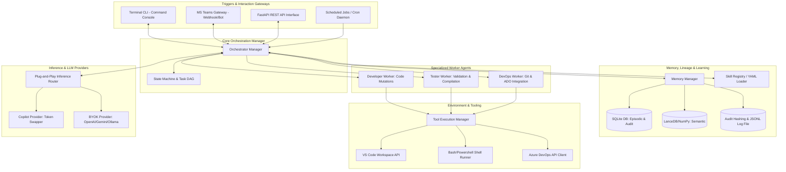

# Agent-X1: Hermes-style Autonomous Agentic Harness (Manager-Worker Topology)

This document details the architecture, design, and protocols for **Agent-X1**, an autonomous, self-improving agent harness. The project uses a **Hierarchical Manager-Worker multi-agent topology** designed to run locally on Windows & Linux (compatible with macOS), hook into VS Code workspaces, leverage GitHub Copilot's CLI authentication or other plug-and-play providers (BYOK) for inference, and interact with the user via a terminal CLI, REST API, scheduled jobs, and MS Teams.

---

## 1. System Topology & Architecture

Agent-X1 decouples task planning (the Manager role) from execution modules (the Worker role). This isolates context and improves stability during long execution cycles.



---

## 2. Inference Layer: Copilot Token Exchange & BYOK Router

To provide a seamless developer experience, Agent-X1 provides a plug-and-play inference interface that supports both zero-configuration local Copilot authentication and Bring Your Own Key (BYOK) setups for standard commercial models.

### 2.1 The Inference Router Interface
In the configuration (`config.yaml`), the user can specify the active provider:
```yaml
inference:
  active_provider: "copilot" # Options: copilot, openai, anthropic, gemini, ollama
  model: "gpt-4o"
  openai:
    api_key: "ENV_VAR_OR_KEY"
    base_url: "https://api.openai.com/v1"
  ollama:
    base_url: "http://localhost:11434/v1"
```

### 2.2 Default: Copilot Token Extraction & Handshake

If `active_provider` is set to `copilot`, the agent retrieves the current CLI or VS Code session token from the local filesystem:
- **Windows**: 
  - `%APPDATA%\github-copilot\hosts.json`
  - `%USERPROFILE%\.config\gh\hosts.yml`
- **macOS/Linux**:
  - `~/.config/github-copilot/hosts.json`
  - `~/.config/gh/hosts.yml`

#### Handshake Steps:
1. **OAuth Verification**: The swapper reads the `oauth_token` (prefixed with `ghu_`) mapped to `github.com`.
2. **Session Token Exchange**: A GET request is dispatched to `https://api.github.com/copilot_internal/v2/token` containing `Authorization: Bearer <oauth_token>` and the `User-Agent: GithubCopilot/1.250.0`.
3. **API Request Routing**: Standard chat completion payloads are sent to `https://api.githubcopilot.com/chat/completions` using the retrieved JWT session token.

## 3. Scheduled Jobs & Background Daemon

Agent-X1 incorporates a lightweight background scheduler (using `APScheduler` or a dedicated asyncio timing loop) running as a persistent background daemon:
- **Windows**: Configurable to run as a native Windows Service (using `win32serviceutil` wrapper) or a background Windows Task Scheduler script.
- **Linux**: Managed via a standard `systemd` service unit file (`agent-x1.service`) or run in-background via standard process managers (e.g., `pm2`, `nohup`).

### 3.1 Use Cases for Scheduled Jobs
* **Daily Backlog Sweep**: Poll Azure DevOps for newly assigned tasks.
* **Codebase Health Check**: Nightly runs of test suites and dependency audits.
* **Memory consolidation**: Offline job that reviews the day's execution logs and distills lessons learned.

### 3.2 Job Schema & Registration
Jobs are defined in `jobs.yaml`:
```yaml
jobs:
  - name: sync_backlog
    cron: "*/15 * * * *"  # Every 15 minutes
    task: "tasks.sync_devops_backlog"
  - name: nightly_test_audit
    cron: "0 2 * * *"     # Every night at 2:00 AM
    task: "tasks.run_workspace_tests"
```

---

## 4. API Interface (FastAPI Integration)

The agent runs a local REST API using FastAPI. This provides programmatical integration with external tools (e.g., local hooks, custom scripts, external webhooks).

### 4.1 Core Endpoints
* `POST /v1/tasks/run`: Dispatches a goal dynamically to the orchestrator.
  - **Behavior**: If the agent is currently executing another task, this endpoint queues the request and returns an immediate HTTP 202 status.
  - **Response Payload**:
    ```json
    {
      "task_id": "8f8b056e-8ee5-4b07-9e79-58caf4bb1862",
      "status": "queued",
      "queue_position": 3,
      "message": "Task queued successfully. Current queue position: 3."
    }
    ```
* `GET /v1/tasks/{task_id}/status`: Fetches execution logs, state, queue position, and task breakdown graph.
* `POST /v1/tasks/{task_id}/approve`: Intercepts human-in-the-loop gating (used by MS Teams or CLI).
* `GET /v1/skills`: Lists all dynamically learned skills.
* `GET /v1/memory/search?query=...`: Searches semantic memory for past issues.

---

## 5. Azure DevOps (ADO) Integration

To act as a first-class team member, Agent-X1 interfaces directly with Azure DevOps using the official ADO REST APIs.

```
┌────────────────────────────────────────────────────────┐
│              Azure DevOps Integration                  │
├────────────────────────────────────────────────────────┤
│                                                        │
│  1. Sync Backlog  ──►  Poll ADO Work Items (Kanban)    │
│                        Finds work assigned to Agent-X1 │
│                                                        │
│  2. Local Work    ──►  Creates branch & applies edits  │
│                        Executes local test suite       │
│                                                        │
│  3. Git Commit    ──►  Commits code linked to task     │
│                        Push to Azure Git Repo          │
│                                                        │
│  4. Pull Request  ──►  Raises PR via ADO API           │
│                        Adds linked Work Item           │
│                                                        │
└────────────────────────────────────────────────────────┘
```

### 5.1 Monitoring the Kanban Board
* **Polling Loop**: Using the scheduled job system, the agent queries the work item backlog:
  `POST https://dev.azure.com/{organization}/{project}/_apis/vit/wiql?api-version=7.1`
* **Query**: Retrieves Work Items where `[System.AssignedTo] = 'Agent-X1'` and `[System.State] = 'To Do'`.
* **State Updates**: When the agent begins work, it moves the item state to `Doing` / `In Progress` using a patch request:
  `PATCH https://dev.azure.com/{organization}/{project}/_apis/wit/workitems/{id}?api-version=7.1`

### 5.2 Commit and Pull Request Automation
1. **Branch Creation**: The agent creates a task-specific branch: `git checkout -b feature/task-{work_item_id}`.
2. **Coding & Verification**: The orchestrator performs edits and runs local tests.
3. **Linked Git Commit**: Commits follow a strict semantic linking format: `git commit -m "feat: resolve bug #12345 - linked work item"`.
4. **Push & Pull Request creation**:
   - The branch is pushed to ADO Git.
   - The agent dispatches a POST request to:
     `POST https://dev.azure.com/{organization}/{project}/_apis/git/repositories/{repositoryId}/pullrequests?api-version=7.1`
   - The body associates the source branch with target (e.g. `main`), includes a descriptive summary, and links the Work Item ID (`/relation` schema) so that it automatically associates in the ADO Kanban interface.

---

## 6. Audit Logging, Hashing & Lineage System (Security & Compliance)

For enterprise security compliance, Agent-X1 maintains strict transparency logs that track data provenance, file edit history, and action accountability. This allows security groups to inspect exactly what the agent did, why it did it, and who approved it.

### 6.1 Transaction Correlation & Hashing
1. **Correlation ID**: Every session initiated via CLI, Scheduler, or API is assigned a unique `Correlation-ID` (UUIDv4). This ID is propagated across all log streams, LLM prompts, files touched, and Git commits.
2. **SHA-256 Hashing**: For any file modified by the agent, the harness records:
   - File path (relative to workspace).
   - Pre-edit file SHA-256 hash.
   - Post-edit file SHA-256 hash.
   - Complete line-by-line patch/diff.
3. **Commit Linkage**: Git commits pushed to Azure DevOps include the Correlation ID in the commit metadata.

### 6.2 Structured Audit Log Schema
Logs are written to an append-only JSON Lines file (`logs/audit_lineage.jsonl`) to ease SIEM integration (e.g., Splunk, Sentinel):

```json
{
  "timestamp": "2026-06-25T18:40:00.000Z",
  "correlation_id": "f97f4c0b-8525-4e69-86c6-9419637bcd6d",
  "actor": "agent:executor",
  "action": "file_write",
  "status": "success",
  "metadata": {
    "file_path": "src/utils.py",
    "pre_hash": "e3b0c44298fc1c149afbf4c8996fb92427ae41e4649b934ca495991b7852b855",
    "post_hash": "86641e7552aa8e6986c69419637bcd6d9419637bcd6d9419637bcd6da419637b",
    "tool_name": "replace_file_content",
    "llm_reasoning": "Adding retry loop to network request to handle temporary DNS failures."
  }
}
```

### 6.3 Accountability & Human-in-the-Loop Logs
Any action requiring human approval (MS Teams tap, CLI keyboard press) logs the authorization context:
```json
{
  "timestamp": "2026-06-25T18:40:15.000Z",
  "correlation_id": "f97f4c0b-8525-4e69-86c6-9419637bcd6d",
  "actor": "human:approver",
  "action": "gate_approval",
  "status": "approved",
  "metadata": {
    "approver_id": "user@company.com",
    "gate_type": "teams_card_click",
    "action_approved": "execute_shell_command",
    "command": "npm install dotenv"
  }
}
```

### 6.4 The Lineage Trace Replay
To audit an event, security analysts can run the tool:
`python -m agent_x1.audit --correlation-id <id>`
This reads the SQLite and JSONL audit logs to generate an interactive timeline showing:
1. **Goal Request**: Who/what triggered it and when.
2. **LLM Thoughts**: Original task planning & decomposition.
3. **Execution Trace**: Sequence of tools called, exit codes, and stdout.
4. **File Mutations**: Interactive diff viewer for all modified files.
5. **Git Push & PR**: Target branch, pull request link, and Azure DevOps Work Item links.

---

## 7. Deterministic Orchestrator & Task Allocation Engine

To prevent autonomous loop failures, the agent does not operate on a free-form "next-step" loop. It uses a structured **State Machine** with a clear plan-and-verify workflow.

```
[Idle] 
  │
  ▼ (User Goal)
[Planning & Decomposition] ────► Creates Directed Acyclic Graph (DAG) of Tasks
  │
  ▼
[Task Execution Loop] <────────┐
  │                            │
  ├──► Execute Step (Tool)     │ (Iterate Tasks)
  │                            │
  ├──► Verify Outcome          │
  │      ├─► Success ──────────┘
  │      └─► Failure 
  │            ▼
  │          [Error Handler]
  │            ├─► Auto-Correct (Fix & retry up to 3x)
  │            └─► Escalate to Human (Pause & notify CLI/Teams)
  ▼
[Goal Completed / Learn Phase]
  │
  ▼
[Dynamic Skill Generation]
```

### 7.1 Task Schema (DAG)
Tasks are represented as objects with state transitions:
```python
class TaskState(str, Enum):
    PENDING = "pending"
    RUNNING = "running"
    SUCCESS = "success"
    FAILED = "failed"

class TaskNode:
    id: str
    description: str
    dependencies: List[str]  # IDs of tasks that must finish first
    state: TaskState
    assigned_tool: Optional[str]
    tool_args: Optional[dict]
    verification_step: Optional[str]
```

### 7.2 Error Classification & Recovery Matrix

When a command or tool fails, the orchestrator applies a classification policy to prevent infinite loops:

| Error Type | Detection Metric | Resolution Strategy |
| :--- | :--- | :--- |
| **Syntax / Compilation** | Stdout/Stderr matches compiler regex, exit code != 0 | Extract error lines -> feed to LLM with file context -> apply diff -> rebuild. |
| **Tool Permission** | Access denied, OS PermissionError | Escalate to user immediately for terminal approval or path adjustments. |
| **API Rate Limit** | HTTP 429 status code | Apply exponential backoff (starting at 30 seconds), then retry. |
| **Semantic Drift** | Verification criteria returns `False` | Reset local task state, increment attempt counter, generate alternate plan. |

---

## 8. Local Persisted Memory System (Partitioned & Cross-Referencable)

To maintain context boundaries while enabling global learning, Agent-X1 divides its memory into distinct spaces for the Orchestrator Manager and each Worker. Agents can write only to their own namespace but possess read permissions to query and cross-reference other agents' memories.

```
┌────────────────────────────────────────────────────────┐
│            Partitioned Memory Structure                │
├────────────────────────────────────────────────────────┤
│                                                        │
│  Orchestrator   ──►  [Write/Read] ──► Orchestrator Mem  │
│  Manager        ◄──  [Read Only]  ──► Code/Test/Git Mem │
│                                                        │
│  CodeWorker     ──►  [Write/Read] ──► CodeWorker Mem   │
│  Subagent       ◄──  [Read Only]  ──► Test/Git/Orch Mem │
│                                                        │
│  TestWorker     ──►  [Write/Read] ──► TestWorker Mem   │
│  Subagent       ◄──  [Read Only]  ──► Code/Git/Orch Mem │
│                                                        │
└────────────────────────────────────────────────────────┘
```

### 8.1 Episodic Memory (Structured Ledger)
* **Engine**: SQLite (`memory.db`)
* **Schemas**:
  - `sessions`: Session ID, Goal, Start Time, End Time, Status.
  - `actions`: Action ID, Session ID, **agent_owner** (orchestrator/codeworker/testworker/devopsworker), Timestamp, Tool Called, Arguments, Stderr/Stdout, Status.
  - `feedback`: Action ID, **agent_owner**, LLM Evaluation Score (1-5), Failure Notes.
* **Partition Enforcement**: Queries default to filtering by `agent_owner`. Indexes are configured on `(agent_owner, session_id)` for rapid lookup.

### 8.2 Semantic Memory (Vector Space)
* **Engine**: NumPy-based cosine similarity or LanceDB.
* **Embeddings**: Generated using a lightweight CPU-based model (e.g. `sentence-transformers`) or the Copilot API.
* **Metadata Schema**:
  ```json
  {
    "vector": [0.012, -0.045, ...],
    "metadata": {
      "agent_owner": "testworker",
      "category": "compilation_fix",
      "issue": "Missing DLL import during MSBuild execution",
      "solution": "Configure MSBuild parameter /p:ReferencePath=...",
      "timestamp": 1813953600
    }
  }
  ```

### 8.3 Cross-Referencing Interface (API)
The `MemoryManager` in `memory.py` exposes cross-referencing capabilities:
* `def write_memory(agent_owner: str, data: dict)`: Writes to the agent's partitioned database and vector space.
* `def query_memory(caller_agent: str, query: str, target_owners: List[str] = None) -> List[dict]`:
  - Callers can pass a list of target namespaces (e.g., `target_owners=['codeworker', 'testworker']`) to query and learn from actions completed by sibling worker agents. For instance, the `CodeWorker` can query the `TestWorker`'s log history to see what tests succeeded or failed on a particular module in previous runs.

### 8.4 Prompt Enrichment & RAG Pipeline

Before the Orchestrator or a Worker Agent submits a prompt to the LLM (Copilot or BYOK), the system runs an automatic prompt enrichment sequence:

```
Step 1: Get Current Task Description / Error Trace
                     │
                     ▼
Step 2: Query SQLite (Episodic) & Vector DB (Semantic)
  - Search caller's partition & cross-referenced worker partitions
                     │
                     ▼
Step 3: Filter & Rank Results
  - Keep top N results with similarity score > 0.75
                     │
                     ▼
Step 4: Format Context Block
  - Render file diffs, past solution summaries, and rules
                     │
                     ▼
Step 5: Inject into System Prompt
  - LLM receives context-enriched system instruction
```

#### Context Formatting Schema
The retrieved memory nodes are compiled into a markdown block and prepended to the system instructions:
```markdown
=== RELEVANT CONTEXT FROM LOCAL PERSISTED MEMORY ===
[Memory Match #1]
- Source Agent: TestWorker
- Category: compilation_fix
- Issue: MSBuild target missing ReferencePath DLLs
- Resolution: Configured task arguments to append '/p:ReferencePath=C:\libs'
- Code/Action Diff:
  ```diff
  - subprocess.run(["msbuild", sln_path])
  + subprocess.run(["msbuild", sln_path, "/p:ReferencePath=C:\libs"])
  ```

[Memory Match #2]
- Source Agent: CodeWorker
- Category: file_edit
- Issue: File lock error on Windows overwrite
- Resolution: Wrapped file writing in retry block with random jitter.
=====================================================
```
This context allows the LLM to reuse successful solutions and avoid repeating previous errors within the workspace.

---

## 9. Self-Improving Dynamic Skill Engine

A core requirement is the ability to build its own skills from successful actions.

### 9.1 Skill Representation (`SKILL.yaml`)
Skills are saved in `~/.agent-x1/skills/` as YAML metadata + python script:
```yaml
name: build_net_solution
description: Builds C# solutions using MSBuild with custom configuration
triggers:
  - extension: .sln
  - command: build
parameters:
  solution_path: string
  configuration: string (default: Release)
code_reference: "scripts/build_net_solution.py"
```

### 9.2 The Skill Creator Pipeline
1. **Compilation of Success Trace**: When a session finishes successfully with a task execution trace, the **Skill Creator** agent scans the `actions` SQLite ledger.
2. **Abstraction**: It filters out specific file paths and extracts the generalized command structure (e.g., converting `dotnet build C:\users\app\MyProj.sln --configuration Release` into a generalized utility script).
3. **Drafting Code**: The LLM writes a Python wrapper script exposing parameters, implementing safety checks, and printing clean outputs.
4. **Validation**: The script is linted and loaded into the local registry.
5. **Retrieval**: During future tasks, the Orchestrator checks the `triggers` of all registered skills. If a match is found, it presents the skill as a primary tool to the planning LLM.

---

## 10. VS Code Integration Strategy

To inspect the workspace, read open editors, and check cursors, Agent-X1 runs a background daemon:
1. **Workspace Sync**:
   - The agent reads files directly from the active project root directory.
   - Monitors changes using file system watchers (`watchdog` package).
2. **VS Code CLI Interaction**:
   - Executes `code --diff file1 file2` to show differences.
   - Leverages `.vscode/tasks.json` if available.
3. **MCP Extension Interface (Optional)**:
   - Exposes a Model Context Protocol (MCP) server over Stdio/SSE.
   - Allows standard MCP-compatible VS Code extensions to leverage Agent-X1 as a backend tool provider.

---

## 11. Cross-Platform Execution Abstraction (Windows / Linux / macOS)

To ensure seamless operation across host operating systems:

### 11.1 Shell Execution Routing
The `ToolRunner` abstracts shell commands via `sys.platform`:
* **Windows**: Runs commands via `powershell.exe -NoProfile -ExecutionPolicy Bypass -Command "<cmd>"` or `cmd.exe /c "<cmd>"`.
* **Linux / macOS**: Runs commands via `/bin/bash -c "<cmd>"` or `/bin/sh -c "<cmd>"`.

### 11.2 Path Resolution
* Standardizes filesystem paths using Python's `pathlib.Path`.
* Automatically resolves environment variable syntax:
  - Windows: `%APPDATA%`, `%USERPROFILE%`
  - Linux/macOS: `$HOME`, `$XDG_CONFIG_HOME`
* Standardizes all tool output paths using slash unification (`path.as_posix()`) to prevent escaping syntax issues in LLM JSON configurations.
